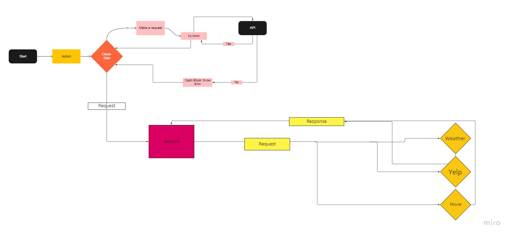

# city-explorer-api

**Author**: Elaine Huynh
**Version**: 1.0.0 (increment the patch/fix version number if you make more commits past your first submission)

## Overview
<!-- Provide a high level overview of what this application is and why you are building it, beyond the fact that it's an assignment for this class. (i.e. What's your problem domain?) -->

## Getting Started
<!-- What are the steps that a user must take in order to build this app on their own machine and get it running? -->

## Architecture
<!-- Provide a detailed description of the application design. What technologies (languages, libraries, etc) you're using, and any other relevant design information. -->

## Change Log
<!-- Use this area to document the iterative changes made to your application as each feature is successfully implemented. Use time stamps. Here's an example:

01-01-2001 4:59pm - Application now has a fully-functional express server, with a GET route for the location resource. -->
Name of feature: Setting up server

Estimate of time needed to complete: 30 min

Start time: 4:20

Finish time: 4:50

Actual time needed to complete: 30 min

Name of feature: Set up weather data

Estimate of time needed to complete: Create weather info on server and render on front-end

Start time: 5:0pm

Finish time: 10:45

Actual time needed to complete: 3.5 hours

Name of feature: Create Error messages 

Estimate of time needed to complete: 1hr

Start time: 11:00pm

Finish time: 11;11pm

Actual time needed to complete: 11min

## Name of feature: Request Data from Weather API

Estimate of time needed to complete: 2hr

Start time: 1:30pm

Finish time: 4:00pm

Actual time needed to complete: 2.5hr

## Name of feature: Display movie data on Front-end

Estimate of time needed to complete: 2hr

Start time: 4:30pm

Finish time: 10:30

Actual time needed to complete: 1hr

## Name of feature: Deploy site
Estimate of time needed to complete: 30 min

Start time: 10:30

Finish time: 10:50

Actual time needed to complete: 20 min

## Credit and Collaborations
<!-- Give credit (and a link) to other people or resources that helped you build this application. -->

## Credit & Collaborations
1. Matthew Larkin - WRRCA Model

2. KC Hofstetter - WRRCA Model 2.0

3. Falashade Greene - WRRCA Model 3.0

